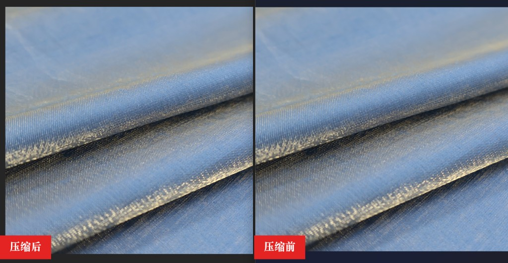
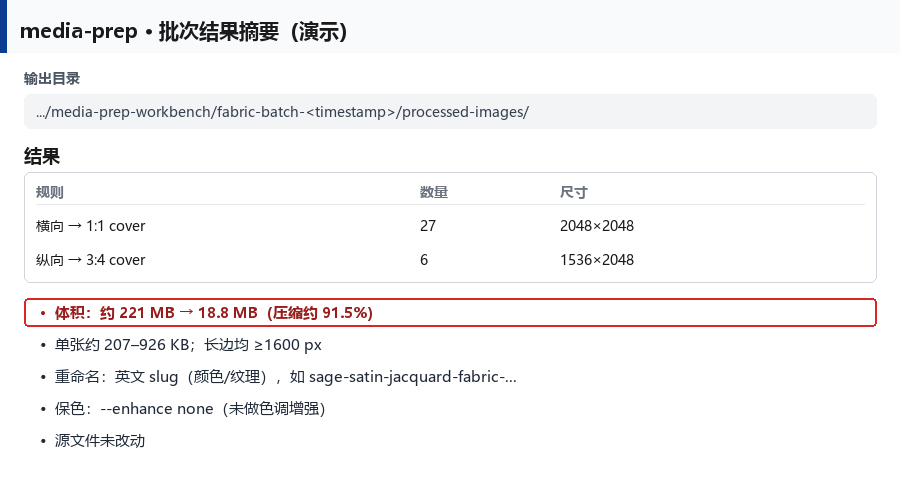
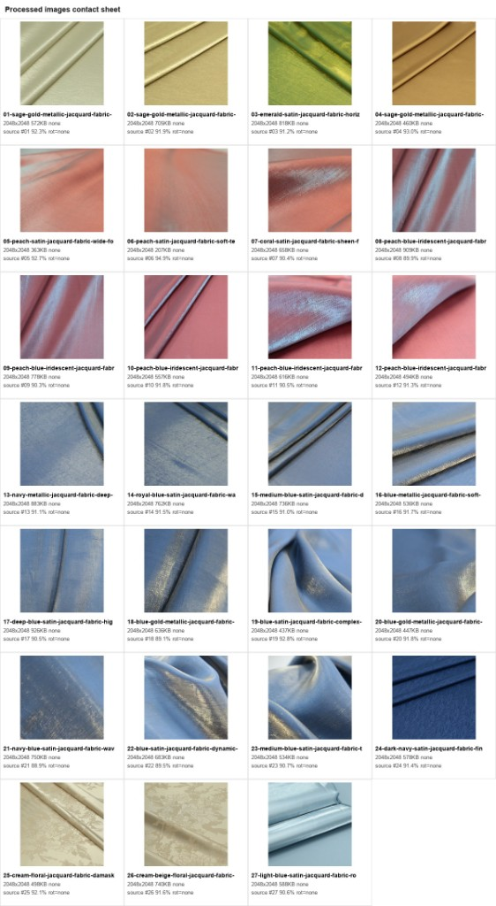

# Media Prep

[](LICENSE)
[](docs/INSTALLATION.md)

Project-neutral workbench for preparing storefront images and videos
(inspect → rename map → process → QA). Shopify-compatible defaults are a
**profile**, not the product identity — the same pipeline targets independent
sites and other catalogs.

## 4 分钟无人值守：裁切 + 压缩

真实面料批次示例：约 **33** 张源图，横向 cover 到 **1:1**、纵向 cover 到 **3:4**，
`--enhance none` 保色；源文件不改动。整批从丢图到可上架素材约 **4 分钟**。


| 指标 | 结果 |
| --- | --- |
| 规则 | 横向 → 1:1 cover（27 张 · 2048×2048）；纵向 → 3:4 cover（6 张 · 1536×2048） |
| 体积 | **约 221 MB → 18.8 MB**（约 **91.5%** 下降） |
| 单张 | 约 207–926 KB；长边 ≥ 1600 px |
| 命名 | 英文 slug（颜色 / 纹理 / 面料） |
| 安全 | 源文件未改动；输出落在独立 `media-prep-workbench\<task>-<ts>\` 目录 |

### 压缩前后对比

肉眼几乎看不出差异，但体积显著下降（左：压缩后 · 右：压缩前）：



### 批次结果摘要



### 处理后 contact sheet

一眼核对构图、命名与体积：



English flow diagram: [assets/diagrams/01-unattended-flow.svg](assets/diagrams/01-unattended-flow.svg).

## Quick start

```powershell
git clone https://github.com/xenos2025/Media-Prep.git
cd media-prep
python -m venv .venv
.\.venv\Scripts\Activate.ps1
pip install -e .
python -m media_prep -h
```

Install the Agent Skill into Cursor:

```powershell
.\install.ps1          # -> ~/.cursor/skills/media-prep-workbench
.\install.ps1 -Project . -Force
```

FFmpeg (`ffmpeg` + `ffprobe`) must be on `PATH` for video commands.

## Replay this batch shape

```powershell
# 1) Inspect + contact sheet
python -m media_prep inspect-images `
  --src "E:\path\images" `
  --out "E:\path\images\media-prep-workbench\fabric-batch-<ts>\inspect-images"

# 2) Prepare names.csv (source_file,output_stem) from the contact sheet

# 3) Unattended crop + compress (color-faithful)
python -m media_prep process-images `
  --src "E:\path\images" `
  --out "E:\path\images\media-prep-workbench\fabric-batch-<ts>\processed-images" `
  --name-map names.csv `
  --enhance none `
  --profile shopify
```

Orientation-specific cover ratios in the demo above were applied as a
task recipe (landscape → 1:1, portrait → 3:4). A built-in dual-ratio flag is
on the [roadmap](TODO.md); until then the agent/CLI can split by orientation
or run two passes.

## Layout

```text
skill/media-prep-workbench/   # canonical agent skill + CLI script
  SKILL.md
  scripts/media_prep.py
  references/
src/media_prep/               # installable python -m media_prep entry
assets/                       # README diagrams + demo screenshots
docs/                         # installation, architecture, upgrade notes
install.ps1 / install.sh      # copy skill into Cursor skills dirs
plugin.json                   # pack metadata
tests/                        # smoke tests
```

This repo is the source of truth. Sync personal Codex/Cursor skill dirs from
`skill/media-prep-workbench/` (or use the installers).

## CLI

```powershell
python -m media_prep inspect-images --src "E:\path\images" --out "E:\path\images\media-prep-workbench\<task>-<ts>\inspect-images"
python -m media_prep process-images --src "E:\path\images" --out "E:\path\images\media-prep-workbench\<task>-<ts>\processed-images" --profile shopify
```

Without install:

```powershell
python skill\media-prep-workbench\scripts\media_prep.py -h
```

Agent workflow, naming rules, and safety defaults:
[`skill/media-prep-workbench/SKILL.md`](skill/media-prep-workbench/SKILL.md).

## Docs

| Doc | Topic |
| --- | --- |
| [docs/INSTALLATION.md](docs/INSTALLATION.md) | Setup options |
| [docs/ARCHITECTURE.md](docs/ARCHITECTURE.md) | How the pieces fit |
| [docs/TROUBLESHOOTING.md](docs/TROUBLESHOOTING.md) | Common failures |
| [docs/generality-upgrade.md](docs/generality-upgrade.md) | Generality roadmap |
| [TODO.md](TODO.md) | Near-term checklist |
| [CONTRIBUTING.md](CONTRIBUTING.md) | How to contribute |
| [SECURITY.md](SECURITY.md) | Vulnerability reporting |
| [PRIVACY.md](PRIVACY.md) | Local-only data handling |

## License

Copyright (c) 2026 **GRC Digital**. MIT — see [LICENSE](LICENSE) and
[NOTICE](NOTICE) (includes the AI editing record for Cursor / Codex /
WorkBuddy).

Open-source packaging layout adapted from
[Skill Self-Check](https://github.com/xenos2025/Skill-Self-Check).
